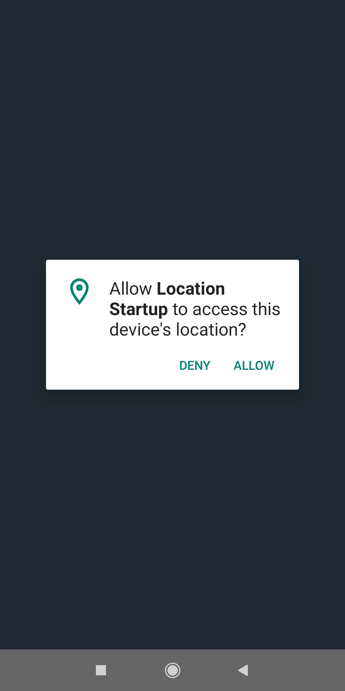
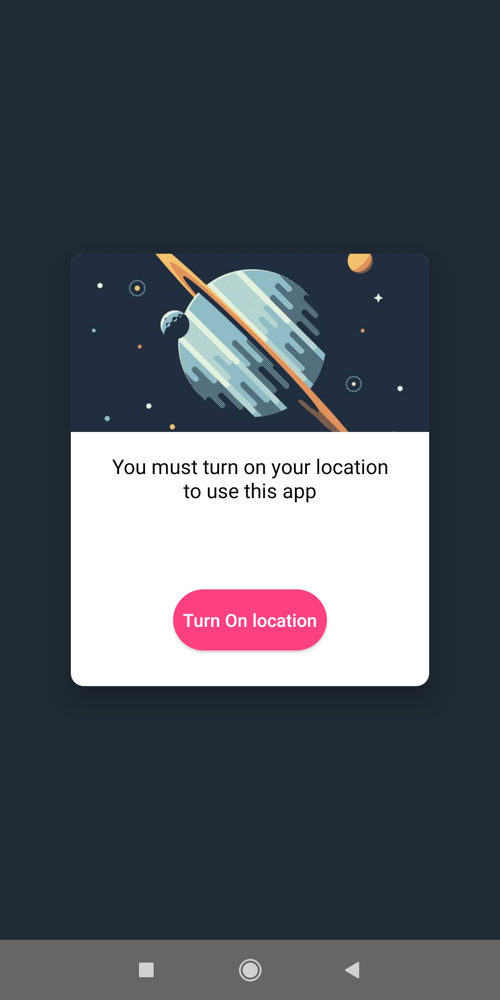
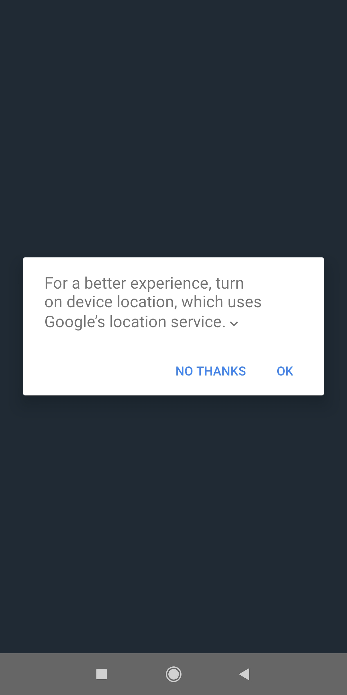
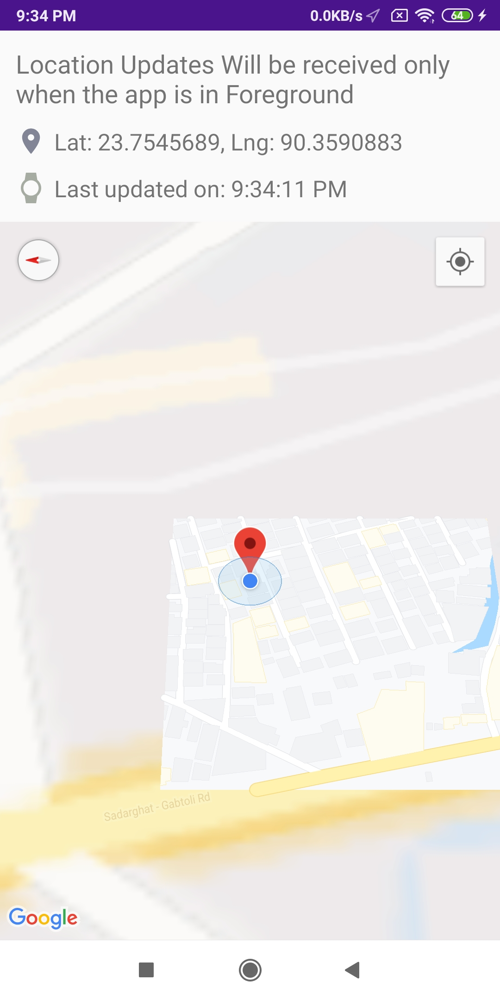
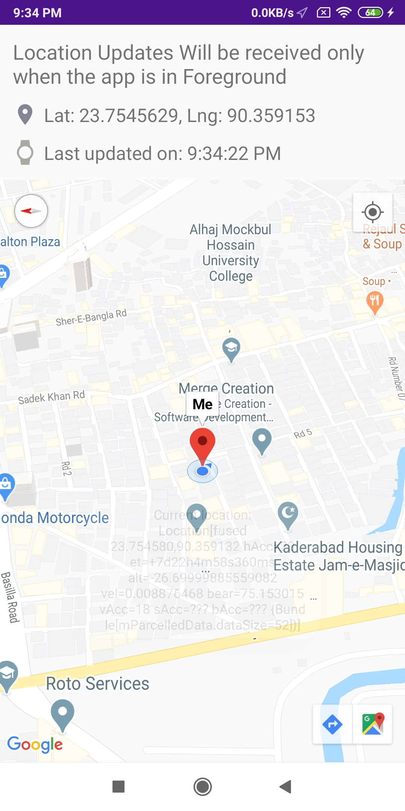
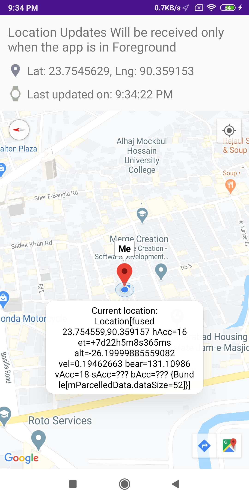

### Location StartUp

location startup is a simple android project which focuses on the basic uses of different location APIs in android along with location permission and how to turn on location provider.In many android projects you need to work with location data for that you need to make sure whether the user granted permission or is the location on or when to ask for permissions.In this project i tried to create such an entry point which ask for all these permissions and other stuff and in later activities i showed hoe to get the location data through FusedLocationProviderClient location API.

### Installation:  
Clone/Copy the project and build through Android Studio to run.

### Usage: App flow at a glance
  

  

  

### Contributing: 

### Credits: 

### License: 

### Authors: [Sadaf Fatin](https://sadaffatin.creatorlink.net/)

